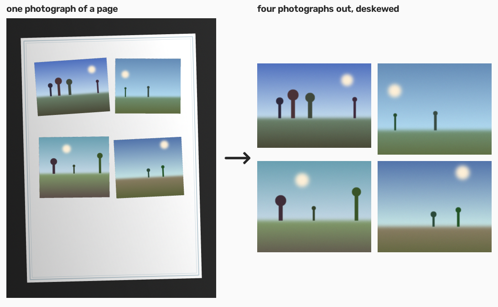
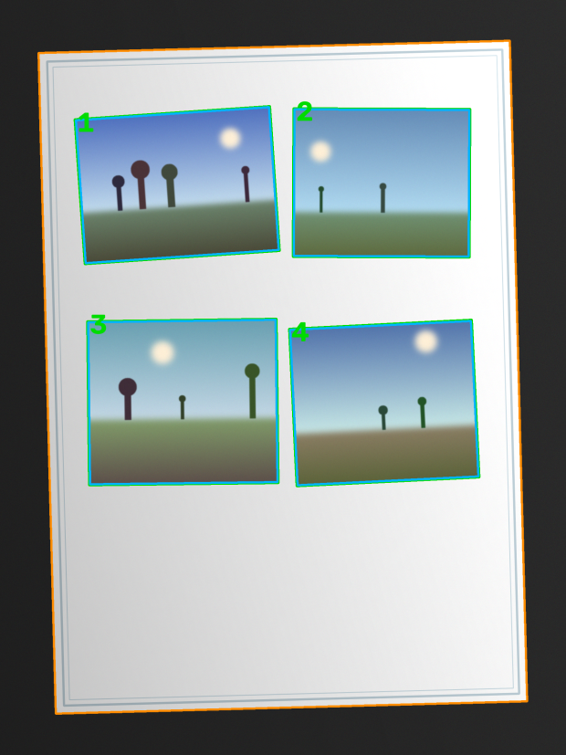
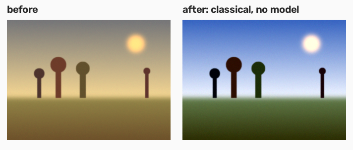

# RevelAI

**Split album page scans into individual photos, then restore them with AI.**

> This is the **engine** package of the [RevelAI monorepo](../../README.md) —
> the Python library and the `revelai` command line tool. The other packages are
> the website and the MCP server.

You photograph a page of a family album with your phone. The page holds five
prints at different sizes and angles, and they are faded, yellowed and scratched.
RevelAI does both jobs, in two independent stages.



| Stage | What it does |
| --- | --- |
| `split` | Takes photographs of album pages and returns each individual print, cropped and deskewed, **with no quality loss whatsoever**. |
| `enhance` | Takes separated photographs and returns restored versions, **never touching the originals**. |

The two stages run separately, in whatever order you like. `split` never depends
on `enhance`.

> All the photographs in this README are synthetic, generated by
> `docs/make_figures.py`. RevelAI does not ship pictures of anybody's family.

---

## Install

```bash
pip install revelai
```

The base install needs nothing but NumPy, OpenCV and Pillow, and it works
completely offline. Two optional extras add the parts that need a network:

```bash
pip install "revelai[vlm]"            # crop verification and descriptions
pip install "revelai[local-models]"   # restoration models that run on your machine
pip install "revelai[all]"            # both
```

## Use it

```bash
revelai split ./album-pages -o ./photos
```

```bash
revelai enhance ./photos -o ./photos-restored --compare-dir ./compare
```

```bash
revelai run ./album-pages --out-split ./photos --out-enhanced ./photos-restored
```

Try it without committing to anything:

```bash
revelai split ./album-pages --dry-run -v
```

```
RevelAI 0.1.0 - split album pages, then restore the photographs

Reading 3 pages from ./album-pages
Dry run: nothing will be written.
  page_1.png: 4 photographs
  page_2.png: 5 photographs  needs review
  page_10.png: 4 photographs

Summary
  pages read           3
  photographs found    13
  numbered             photo_00000001.png .. photo_00000013.png
  pages needing review 1
      page_2.png: size is far from the other photographs on this page; an edge
      is soft; it may be a shadow rather than a border

Nothing was written. Remove --dry-run to write to photos.
Re-run with --review to correct the flagged pages by hand.
```

---

## How the detection works

Most of the difficulty is not finding the photographs. It is finding their
**edges** precisely enough that the crop does not keep a sliver of album paper
or lose a few millimetres of sky.

RevelAI fits **one rotated rectangle** to each print by line integral: it sweeps
the angle in small steps and, at each angle, slides all four edges along their
own normals, scoring each edge by the trimmed mean of the absolute directional
derivative **integrated along the whole edge**. Integrating along the entire
edge lets a long straight line — the real border of the print — outscore any
short high-contrast detail inside the picture, and forcing a single rotated
rectangle prevents the degenerate result where one edge slides onto a
neighbouring photograph and the crop comes out trapezoidal.

Fitting the four lines independently was tried and does not work; it produces
skewed crops. On the synthetic fixtures, where the ground truth is known
exactly, the refinement lands within **IoU 0.994–0.997** of the true rectangle
with an angle error under **0.03°**.



`--debug-dir` writes that map for every page. Green is accepted, red is flagged
for review, cyan is the actual crop after the safety inset, orange is the page.

Before any of that, the page itself is isolated. An album page normally sits on
a dark table, so the background is the *darkest* thing in the frame rather than
the brightest — the opposite of a flatbed scan, and the reason a single global
threshold segments the whole page as one object. The light across a phone
photograph is also uneven, so the album paper is not one colour; RevelAI fits a
smooth illumination surface to the paper first, so that "differs from the paper"
means "differs from the paper *here*".

---

## Restoration: classical first, model second

`enhance` tries the deterministic offline method before it calls any model, and
only calls a model for what is left. That order is not a preference, it is the
design:

```
geometry (already done in split)
  -> classical colour correction        deterministic, offline, invents nothing
  -> denoise
  -> dust and scratch removal
  -> colourisation      (optional, off by default)
  -> face restoration   (optional, off by default)
  -> super-resolution   last, always
```

Super-resolution goes last because it is a magnifier: run it first and every
defect still in the photograph gets magnified along with the picture.

For a yellowed print, a per-channel white balance with percentile clipping does
most of the work on its own. It is instantaneous, runs offline, is
deterministic, and invents nothing. On the test fixture it takes the grey
deviation of a strongly cast print from **71 to 7** — no model involved.



### Which model does what

| Operation | Local backend (default) | Hosted backend (`--backend replicate`) | Approx. cost per photo |
| --- | --- | --- | --- |
| `--color` | percentile white balance | same — never sent anywhere | free |
| `--denoise` | OpenCV non-local means | Real-ESRGAN | ~US$0.004 |
| `--dust` | median-difference detection + inpaint | *(classical is better; not offered)* | free |
| `--upscale` | ONNX super-resolution from the model cache | Real-ESRGAN | ~US$0.004 |
| `--faces` | bring your own ONNX model | GFPGAN | ~US$0.006 |
| `--colorize` | bring your own ONNX model | DeOldify | ~US$0.012 |

The local backend's classical operations need no model at all, and they are what
the default run uses.

The model-backed ones load ONNX from `~/.cache/revelai/models` and report
themselves unavailable until a model is there — never a silent no-op. **One
model ships in the registry today**, a small super-resolution network for
`--upscale`; `--faces` and `--colorize` have no registered local model yet, and
say so with the environment variable to point at your own:

```
$ revelai enhance ./photos -o ./out --faces
  operations skipped
      faces: RevelAI has no local model registered for faces. Point at your own
      ONNX model with REVELAI_MODEL_FACES, or use --backend with a hosted provider.
```

No model is hardwired anywhere. Each is a registry entry in
[`models.py`](src/revelai/enhance/backends/models.py) paired with a runner that
knows how to feed it, so swapping one for a better model is an edit to that
table rather than to the restoration code — which matters, because the models
worth using will change faster than this tool will.

---

## Trusting a large batch: `--verify`

This is the most valuable feature in the project.

Fifty album pages produce two hundred crops, and nobody is going to inspect them
one at a time. Without a check, the honest summary of such a run is "I processed
fifty pages and I do not know whether it came out right".

`--verify` asks a vision-language model one structured question about every
crop — is this exactly one complete photograph, is it cut off at any edge, is
there a leftover sliver of another photo or of the page, which way up is it —
and turns that into:

```
  crops verified       196 of 200 passed
      photo_00000042.png: cut off at the left
      photo_00000078.png: more than one photograph in the crop
```

That is the difference between a tool you can trust with an album and one you
have to audit by hand. `--auto-orient` reuses the same answer to put each
photograph upright, with a lossless quarter turn.

A vision-language model is used here to **judge and describe, never to change a
pixel**. The models that actually restore an image are a different kind of thing
and live somewhere else entirely. If no API key is set, `--verify` says so and
the run continues; a batch that could not be checked is reported as unverified,
never as passing.

`--describe` writes a caption, tags, an estimated decade and any date stamp or
handwritten caption into the PNG metadata. It counts the people present; it
never tries to identify them.

---

## Review by hand: `--review`

Detection gets things wrong. That is an observed fact, not a hypothesis, which
is why interactive review is a normal part of the flow rather than an
afterthought. `--review` puts the page on screen with numbered boxes:

| | |
| --- | --- |
| drag inside a box | move it |
| drag a corner | resize it |
| drag on empty paper | create a box |
| `d` | delete the selected box |
| `r` / `R` | rotate by 0.25° |
| `f` | re-run the refinement on the selected box |
| `Enter` | accept the page |
| `s` | skip it |
| `q` | quit |

Every manual edit goes back through the refinement before it is cropped, so a
box you drew by hand still gets sub-pixel borders and a deskew. On a machine
with no display this warns and falls back to automatic mode; it does not crash.

---

## How to photograph album pages

The quality of the input decides everything downstream. Five minutes of care
here saves an hour of review later.

- **Indirect window light. No flash.** A flash puts a hotspot in the middle of
  the page and a hard reflection on any glossy print.
- **Phone parallel to the page.** Hold the camera square on, not at an angle.
  RevelAI corrects rotation in the plane; it cannot undo perspective from a
  camera held off to one side.
- **Leave a margin.** Get the whole page in frame with room around it. A print
  that runs off the edge of the photograph cannot be cropped whole.
- **Dark, matte background.** A table works. This is what lets the page be found
  at all — see the page isolation step above.
- **Half a page at a time.** Photographing half a page doubles the resolution of
  every print on it. If the album is worth digitising, it is worth two exposures
  per page.
- **Watch your own shadow.** Leaning over the page puts a soft-edged shadow
  across it. RevelAI rejects soft edges as shadows rather than borders, but it
  is better not to make it guess.

---

## Privacy

These are family photographs. That is not a footnote, it is a requirement.

- **The local backend is the default, and the whole tool works with no API key
  at all.** Nothing is uploaded, nothing is sent anywhere, no account is needed.
- **A hosted backend uploads your photographs to a third party.** The first time
  one is used in a run, the CLI states where the images are going and asks for
  confirmation. `--yes` skips the prompt for automation.
- **`--verify` and `--describe` also send images** — to Anthropic, for the
  question being asked. They are off unless you ask for them. Only a downscaled
  copy is sent; the file on disk is never modified.
- Nothing is ever uploaded during a `--dry-run` that does not use those flags,
  and no test in this repository touches the network.

---

## Honest limitations

**Detection fails on low-contrast pages.** A print faded to nearly the tone of
the paper it is mounted on, on a page with a busy texture, may be missed or
cropped short. This is why `--review` exists and why it is not hidden away. Run
`--verify` on a large batch and review what it flags.

**Prints that touch or overlap may come out as one crop.** Two photographs
mounted edge to edge are separated only by a shadow line, and where one print is
laid over another the union is an L shape whose borders belong to two different
rectangles. Locally there is nothing in the image that says which.

RevelAI measures how strong the strongest line running through a crop is,
relative to that crop's own borders. Across the test fixtures a *single*
photograph reaches 0.287 — a horizon, a roofline or the edge of a table all
produce a long straight line inside a perfectly ordinary photograph — and a
genuine seam between two prints starts at 0.320. A margin of ten per cent is not
enough to cut a photograph on, so RevelAI does not.

What it does instead: it separates the pair when the detection strategies
independently propose both halves, and otherwise returns one crop that says
`may be two photographs mounted edge to edge` and flags the page. The invariant
the test suite enforces is that **no crop is ever both wrong and unflagged**.

**Face restoration reconstructs faces. It does not reveal them.**

> On a low-resolution photograph the face that comes out **may not be that
> person's face**. The model produces a plausible face, not the one that was
> there. For a family photograph, where the entire value is that it is that
> specific person, this is a serious defect and not a footnote.

That is why `--faces` is off by default, why the CLI prints the warning before
running, and why the restored file never replaces the original. Use
`--compare-dir` and look at both before you keep anything.

**Colourisation invents the colour.** The result is a plausible guess about what
the scene might have looked like. It is not a record of it. A dress that comes
out blue was not necessarily blue. `--colorize` is off by default and prints the
same kind of warning.

**A vision-language model can be wrong too.** `--verify` reduces the number of
crops you have to look at; it does not reduce it to zero.

---

## Output rules

These are strict, and they are what makes the output safe to point a script at.

- The output folder contains **exclusively** `.png` files. No JSON, no logs, no
  thumbnails, no maps, no reports, no subfolders. Debug output, comparisons and
  index files exist only when you ask for them by flag, and go elsewhere.
- Filenames are `photo_XXXXXXXX.png` — a sequential integer zero-padded to eight
  digits. Numbering is **global and continuous across the whole run**; it does
  not restart per page.
- Ordering is deterministic: pages in natural filename order (`page_2` before
  `page_10`), and within a page top to bottom, then left to right for prints
  sharing a horizontal band. **Two runs over the same input produce exactly the
  same names.**
- `enhance` **preserves the input filename**. A restored `photo_00000042.png` is
  still `photo_00000042.png`, in a different folder, so the original and the
  restored version always correspond.
- `enhance` **never writes into its input folder**. Pointing `--output` at the
  source is an error, checked before any work starts.
- **Nothing is ever overwritten.** With no `--start-index`, a run continues from
  the highest number already in the output folder, so an album can be digitised
  over several sessions. With an explicit `--start-index` that would collide,
  the run stops and says which file is in the way.

## Image quality

- **One single resampling per photograph.** The crop and the deskew happen in
  one `warpPerspective` on the original full-resolution pixels, with
  `INTER_LANCZOS4`. Detection may run on a downscaled copy; cropping never does.
- Output size is the real pixel size of the crop, rounded. Nothing is scaled up
  or down.
- Lossless PNG. No colour quantisation, no bit-depth reduction; 16-bit input
  stays 16-bit.
- **`split` makes no colour, brightness, contrast, saturation, sharpening or
  noise adjustment of any kind.** It crops and deskews. There is a test that a
  flat patch comes out of the crop with exactly the value it had on the page.
- The source ICC profile is preserved.
- Provenance is written into PNG `tEXt` chunks: source file, the four corner
  coordinates on the page, the angle applied, the tool version, and — in
  `enhance` — the exact list of operations and models applied, with versions. A
  restored photograph can say what was done to it. `--no-metadata` disables it.

---

## Command reference

### `revelai split INPUT [-o OUTPUT] [options]`

| Flag | Effect |
| --- | --- |
| `-o, --output DIR` | output folder (default `./photos`) |
| `-r, --recursive` | walk subfolders |
| `--start-index N` | starting number (default: continue from the highest present) |
| `--min-area` / `--max-area` | photo area as a fraction of the page (default `0.005` / `0.9`) |
| `--inset PX` | pixels trimmed inward on every edge (default `3`) |
| `--review` | interactive review before saving |
| `--verify` | VLM crop verification |
| `--auto-orient` | 90° rotation decided by a VLM |
| `--debug-dir DIR` | detection maps, outside the output folder |
| `--dry-run`, `--jobs N`, `-v` | |

### `revelai enhance INPUT [-o OUTPUT] [options]`

| Flag | Effect |
| --- | --- |
| `-o, --output DIR` | output folder (default `./photos_enhanced`) |
| `--color` / `--no-color` | classical colour cast and fading correction (on by default) |
| `--color-strength F` | how much of it to apply, 0 to 1 |
| `--denoise` | noise and grain removal |
| `--dust` | dust and scratch removal |
| `--upscale N` | super-resolution, 2× or 4× |
| `--faces` | face restoration (off by default, prints the warning) |
| `--colorize` | B&W colourisation (off by default, prints the warning) |
| `--backend NAME` | `local` (default) or a hosted provider |
| `--compare-dir DIR` | before/after pairs, outside the output folder |
| `--describe` | caption, tags and estimated decade from a VLM |
| `--index-file PATH` | CSV or JSON index, outside the output folder |
| `--dry-run`, `--jobs N`, `-v`, `--yes` | |

### `revelai run INPUT [--out-split DIR] [--out-enhanced DIR]`

Both stages in sequence.

---

## Prior art

Several projects already solve part of the `split` stage, and they are worth
your attention if RevelAI is not what you need. None of them solves this tool's
case — a phone photograph of an album page, with the album's own paper as the
background, uneven light and decorated borders. All of them assume a flatbed
scanner with a uniform white background, and none combines splitting with
restoration.

- [**z80z80z80/autocrop**](https://github.com/z80z80z80/autocrop) — the most
  popular of them. OpenCV, but one photograph per scan and it needs a rough
  pre-crop. A good reference for rotation correction.
- [**Claytorpedo/scan-cropper**](https://github.com/Claytorpedo/scan-cropper) —
  multiple photographs per image, white background only, no interactive review.
- [**idlerun/album-scan**](https://github.com/idlerun/album-scan) — closest in
  intent: OpenCV plus a UI for fixing corners by hand. The author is candid that
  detection fails without a perfectly white background. Its interaction model
  informed `review.py`.
- [**alexhorn/AutoCrop**](https://github.com/alexhorn/AutoCrop) — tied to
  ImageMagick 6, which is a practical blocker today.
- [**FrancoisMalan/DivideScannedImages**](https://github.com/FrancoisMalan/DivideScannedImages)
  — the classic GIMP script, and the historical reference for this problem.
- Photoshop ships **Crop and Straighten Photos**, with the same uniform
  background limitation.

Running `scan-cropper` on a synthetic album page during this project's design
made the gap concrete: with the page on a dark table, its global inverse
threshold merges the table, the page and every print into a **single contour
covering the whole image**, and it returns the entire page as one "photograph"
at every threshold setting. That is not a criticism of the tool — it is built
for flatbed scans and it does that job — it is the reason this one exists.

### What RevelAI does differently

- **Phone camera input**, not a scanner: dark background, uneven light,
  decorated album borders.
- **Rotated-rectangle refinement by line integral**, rather than contour
  approximation.
- **VLM verification**, which is what makes a fifty-page batch trustworthy.
- **Interactive review as a normal part of the flow**, not a fallback.
- **Optional restoration in a separate stage** that never touches the original.
- **Strictly lossless output.**

---

## Development

```bash
git clone https://github.com/maikotrindade/revelAI
cd revelAI/packages/engine
python -m venv .venv && source .venv/bin/activate
pip install -e ".[dev]"
pytest -q
ruff check .
```

Everything in this package is self-contained: its own `pyproject.toml`, its own
tests, its own figures. Nothing outside `packages/engine/` is needed to build,
test or run it.

229 tests, all offline: no test touches the network or needs an API key. Every
image in the suite is generated by `tests/synth.py`, which builds album pages
from a specification and carries every ground-truth corner through the placement
transform analytically, so accuracy is measured against the rectangle that is
actually on the page.

See [CONTRIBUTING.md](../../CONTRIBUTING.md) for the ground rules.

### A note on naming

The repository is `revelAI` in mixed case. That casing stops at the repository
name.

| Context | Value |
| --- | --- |
| GitHub repository | `revelAI` |
| Python package / import | `revelai` |
| Distribution on PyPI | `revelai` |
| CLI command | `revelai` |
| Product name in prose | RevelAI |

Mixed-case package names break imports on case-sensitive filesystems and are
against PEP 8, so `revelAI` never appears as a Python identifier, a module name
or a directory under `src/`.

## Licence

MIT. Copyright (c) 2026 Maiko Trindade. See [LICENSE](../../LICENSE).
